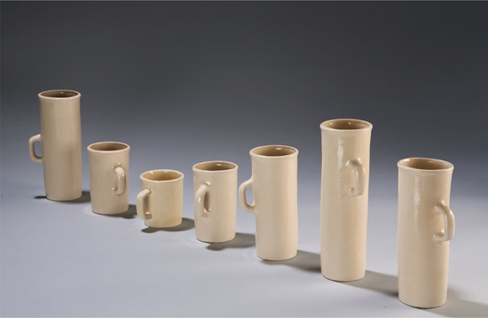

# Generative Design Workshop 

### *Small Data* Final Briefs

##### [Iohanna Nicenboim's](https://iohanna.com/) *Form Follows Data*

### Project Description

The combination of the [quantified self movement](http://feltron.com/), [interactive generative design tools](https://www.shapediver.com/), and [digital fabrication](https://www.shapeways.com/) as a [service for fulfillment and delivery](https://www.shapeways.com/business/whitelabel-shipping-solutions) is creating opportunity for contemporary designers to create *personal products* with *personal data*. We have looked at [several](https://iohanna.com/Form-Follows-Data) [examples](http://www.stefanieposavec.com/airtransformed) of [these](https://www.pentagram.com/work/giorgia-lupi-other-stories/story) [often](http://paulheinicker.com/goodnightsms/) [weird](http://meshu.io/) [pieces](http://mischertraxler.com/) of [physicalized](https://www.adriensegal.com/) [data](https://madmuseum.org/sonic-arcade-audiowear), which all explore the collection of possible relationships between an individual, their social group, their space, their past behaviors, and their participation and responsiblity in larger social, experiential, and environmental outcomes. These objects have the potential to reveal startling patterns in our own behavior, and support a newly empowered sculpting of the self -- facilitated by informed data-gathering and -visualization.

This relationship between collected data and our own behavioral psychology is the nexus to be explored in this project, through the production of unique, personal generatively designed objects.

How can physicalized data become a seed for behavior change? A reward for maintaining positive behaviors? A block against regressing into formerly damaging behaviors? A stark reminder of our past and future weaknesses and strengths? A provocation for new action?

With the linked works above and *Dear Data* as inspiration, envision how an *individual-person-scale* dataset could be embedded in a singular or set of *hand-scale* objects such as jewelry, fashion accessories, desktop objects, or specialty equipment for various activities. Consider how the dataset can effectively (and potentially poetically) relate to the physicalized data. Then, use Grasshopper and digital fabrication technologies to bring these objects in the world through Grasshopper and other generative design tools.

### Deliverables

- Three versions of your design, featuring data representing three different entities — fabricated by hand or machine. For example, if I am designing a necklace featuring data on where a person travels to prompt an audience towards more diverse experiences , I could ask three different people for data and make a necklace for each of them. Or, alternatively, I could ask one person for data spanning three years, and make a necklace for each year. (EDIT: At least one fabricated, two can be rendered or illustrated)

- Annotated dataset used in object. Ideally all input data for this project is real, but if that is impossible, random or sample data can be used for up to two of the variations.

- Annotated Grasshopper and Rhino file(s) of all fabricated models.

- 250-500 word description of your project, the design and fabrication choices you made, and how you imagine its existence might prompt, accelerate, or maintain behavior change. 

- Illustrated key to reading your objects, designed for a 5"x7" post card, double-sided (one side featuring renders or photos), styled in combination with your objects.

### Key Dates

- March 25 - Continuing Grasshopper Demos, Digital Fabrication Discussion
- April 1, 8 , 15 - Worktime and Targeted Demos
- April 22 - Submit for Fabrication with [Shapeways](https://support.shapeways.com/hc/en-us/articles/360008366133-How-long-will-it-take-to-print-my-models-)
- April 29 - Worktime for Brief Collaterals
- May 6 - Last Day of Class - Discussion and Critique

### Recommendations

- *Solving a problem* is rarely a useful framing for design in 2020, especially with experimental tools such as these. The tools are too new for us to know how they can most effectively be applied, and we are not yet looking at the world with the necessary sensitivity to even identify which problems can be addressed with these new methods. Much more productively, we could imagine *what new opportunities are exposed* given the existence of new tools and approaches, and how the world might change after our design intervention. It's a small nuance, but perhaps a helpful one? If we can help even [one person's life be made slightly more examined](https://en.wikipedia.org/wiki/The_unexamined_life_is_not_worth_living), we have done a great service!

- Think carefully about whether your project will *whisper* or *shout* its data both in its form, and in its legibility. There is advantage in an object blending in, and an opposite advantage in standing-out as an obvious data visualization.

- Is your object extensible by its user? Could it be designed to be edited and manipulated? Is there an expectation that new objects are regularly created? Might there be a routine or ritual designed to facilitate self-reflection, data collection, and object editing/updating?

- Think carefully about which types of objects can most effectively trigger the contemplation of self. Further, think even more carefully about which sorts of data might be effective for a personal goal like this.

- Be weird. Do weird stuff. Make weird things. 

### Alternative Options: Your Choice

If any of the other tools, approaches, or algorithmic topic areas discussed during the arc of class is of more personal interest than the brief described above, please write a proposal of comparable specificity to this one, and send to Zach before B-Session begins to discuss.

### Alternative Options: COVID-19 and SARS-CoV-2

The brief above can be articulated towards addressing contemporary urgencies. New behaviors are necessary for [every single human right now](https://www.politico.com/news/magazine/2020/03/19/coronavirus-effect-economy-life-society-analysis-covid-135579), and perhaps data physicalizations can begin to support these social transformations. 

If, however, you would like to drive your generative design project towards some of the many ongoing projects related to visualizing, simulating, educating on, or directly combatting the virus through the tools and approaches we have been covering, please feel free to do so as your final project. Here are some links to get started, though there are thousands of other projects and approaches launching now, and this list will be immediately obsolete.

- [Coronavirus Projects](https://github.com/soroushchehresa/awesome-coronavirus)
- [Mapping Coronavirus Responsibly](https://www.esri.com/arcgis-blog/products/product/mapping/mapping-coronavirus-responsibly/)
- [Policy Simulation](https://covidactnow.org/state/IL)
- [Data Literacy through Coronavirus](https://www.nytimes.com/2020/02/27/learning/dangerous-numbers-teaching-about-data-and-statistics-using-the-coronavirus-outbreak.html?te=1&nl=the-learning%20network&emc=edit_ln_20200228&campaign_id=55&instance_id=16338&segment_id=21710&user_id=940e40924ef077065d92bd3f2f889f90&regi_id=5326076020200228)
- [Coronavirus Physical Structure Communication](https://www.nytimes.com/2020/02/27/learning/dangerous-numbers-teaching-about-data-and-statistics-using-the-coronavirus-outbreak.html?te=1&nl=the-learning%20network&emc=edit_ln_20200228&campaign_id=55&instance_id=16338&segment_id=21710&user_id=940e40924ef077065d92bd3f2f889f90&regi_id=5326076020200228)
- [Next Strain Coronavirus Mutation Prediction](https://github.com/nextstrain/ncov)
- [Design to Combat COVID-19 Slack](https://www.designtocombatcovid19.com/team)
- [Design Class $1000 Challenge](https://www.godesignclass.com/courses/covid19?utm_medium=website&utm_source=archdaily.com)
- [PRUSA Printers Challenge](https://blog.prusaprinters.org/designer-contest-everyday-necessities-for-life-during-a-pandemic-with-three-3d-printers-to-be-won/)
- [Coronavirus Protein Folding](https://foldingathome.org/2020/03/15/coronavirus-what-were-doing-and-how-you-can-help-in-simple-terms/)
- [Open Source Ventilators](https://github.com/jcl5m1/ventilator)
- [Digital Fabrication for Ventilators](https://emcrit.org/pulmcrit/split-ventilators/)