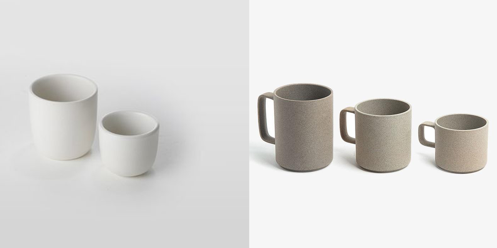
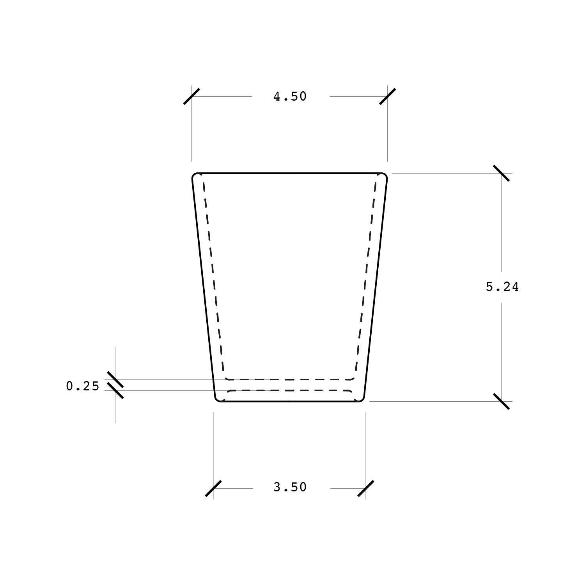
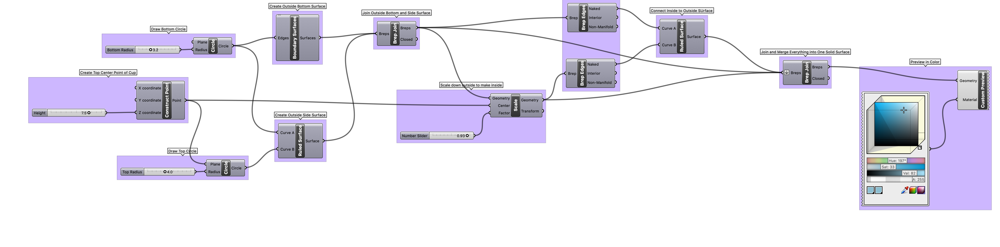
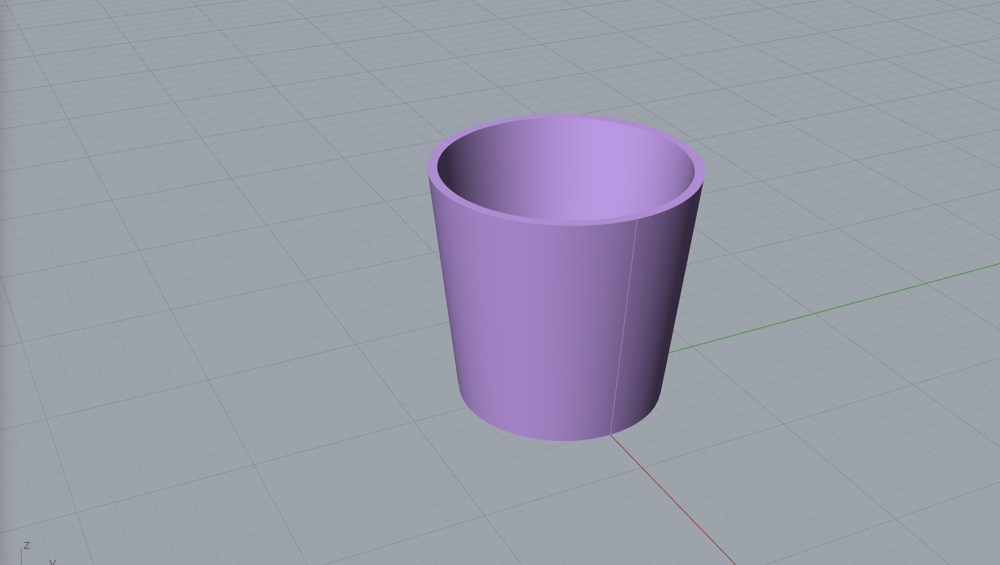
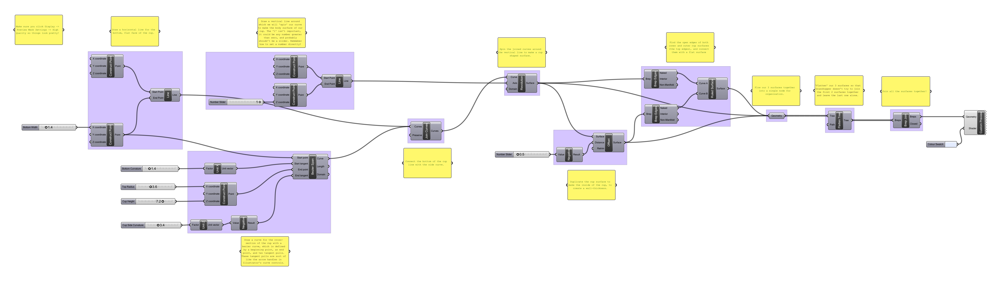
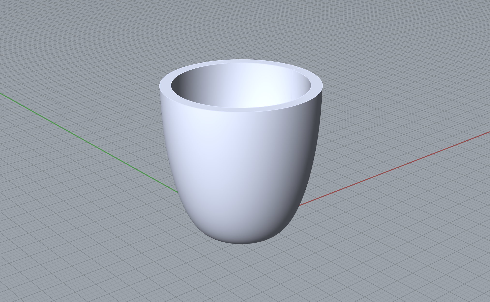
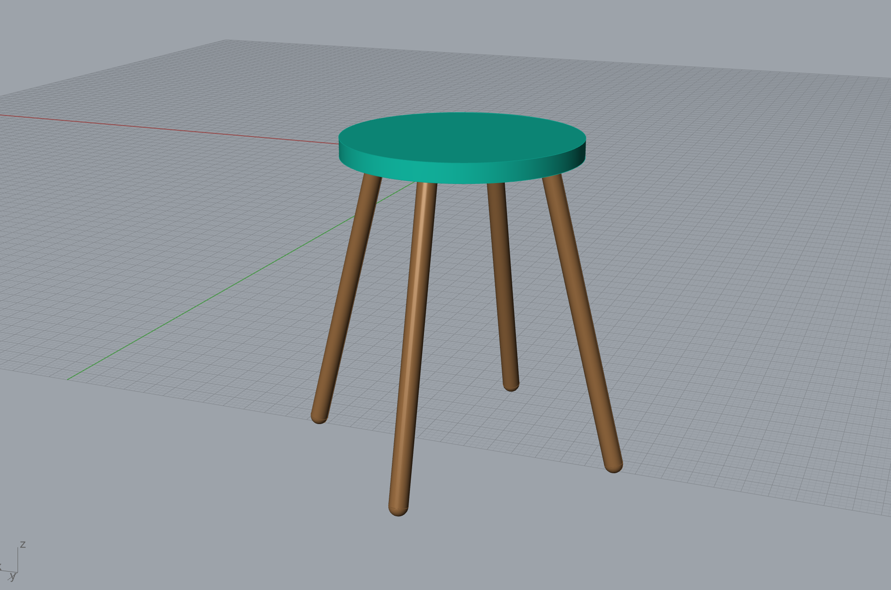
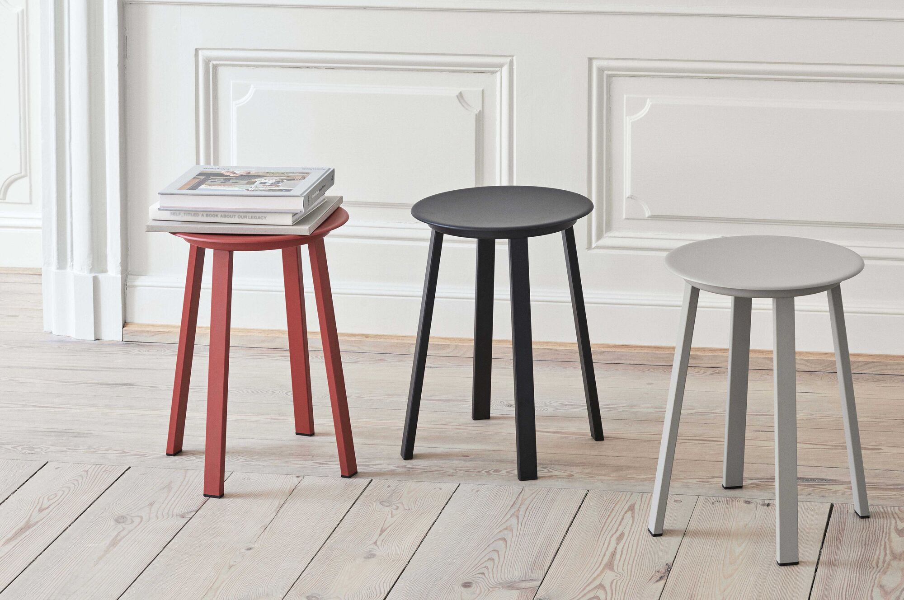

# Week 2 · Parametric Definitions

This week, let's discuss how we as designers can meaningfully *parameterize* a specific design opportunity into a set of dimensionable, flexible, understandable, and ultimately manufacturable or implementable aspects. This approach superficially has much in common with traditional design and engineering methods, though can differ meaningfully in its intentionality and possiblility for expression.

-----

### References for the Week

- [Tylko Bookshelves](https://tylko.com)
- [Article on Tylko with Founder Interview](https://www.curbed.com/2015/6/24/9946872/tylko-furniture-app-augmented-reality)

-----

### Parametric Definitions

A critical early phase in any generative design approach is the creation of a **parametric definition** or **rig**, which is the identification and interrelation of the *designable* aspects of a product, service, or experience. It is important that these aspects all be given names, and have a known degree of flexibility — are they variables or constants? These are the *parameters* of the design, and when connected together, generative designers often term the resulting formula of parameters the *definition* of the design.

When parameters are fully determined, we then have a skeleton, or *chromosome* to stretch the biological analogy, of everything that the design could be. Playing with the parameters will allow a designer to see the full expression of their design — the constellation of all products that might result from their design intent.

This is a powerful mechanism to bring to all design processes — imagine *all of the outcomes* that might come out of your design intent — the *domain of the design*, before making any specific design choices. What are all the possible chairs that might come out of a designer working on *chairs* — it is certainly an infinite set of possibilities, but that infiniteness is bounded by real limitations. At some point, a chair obviously becomes a table or a stool! 

-----

### Parametric Definition Example : Cups

###### Heath on the left, Hasami on the right ######

It is easiest to consider physical products when implementing parametric definitions. For example, the simple parameters of a ceramic cup might be (leaving aside the complexity of the handle) total height, radius/diameter at top, radius/diameter at bottom, foot height, and wall thickness. It is often the case that the simple parameters of a product align with what would be defined in a [common engineering drawing](http://www.loc.gov/pictures/search/?st=grid&co=ade).

More complex parameters might allow for material selection, overall (non-conic) form, handle shape and size, lip geometry, styling and surface finish, ethical decisions about the  environmental impact of its manufacture and social condition of its fabricators, intended product lifespan... And, at some point, this parameter expansion would yield a definition capable of generating bowls, plates, vases, and carafes as well as the original mug.

How might we begin to parameterize something like a subscription video service, [congressional district shape](http://autoredistrict.org), or a community organizing initiative in this same way?

-----

### Types of Parameters

- Flexible : The parameter is entirely free (a couch could be *any* length)
- Categorical : The parameter is allowed to be any member of a set of fixed values (a table could be a *circle*, a *hexagon*, or a *square*)
- Fixed : The parameter has a set value that cannot change (a chair must have *four* legs)
- Dependent : The parameter is algorithmically calculated or determined based on other parameters (the width of a car is *exactly half* its length)

Further, any of the above parameter types may be *optional*, and need not always be numbers!

-----

### Grasshopper Definition · Parametric Shot Glass

In class, we will model a simple shot glass with four parameters.

[Download](shotglass-definition.gh)

This visual code is capable of producing 3D models like this:

-----

### Grasshopper Definition · Parametric Mug

Let's next model a simple mug example in Grasshopper, which offers the ability to product more complex, curving geometry.

[Download](cup-definition.gh)

This visual code is capable of producing 3D models like this:

-----

### Homework

Grasshopper is as powerful as it is impenetrable, and the only way to get good at it is to practice. We will be doing lots of exercises, learning how the tool can enable new design approaches like [evolutionary modeling](http://www.kramweisshaar.com/projects/breeding-tables), [growing design solutions](http://arandalasch.com), and [data-driven form](https://www.adriensegal.com). Please complete all of these homework bits and pieces before next week, and bring all your work to class.

##### Acclimation to GenDes Resources (.5 hours)

Unfortunately, there are not a whole lot of good beginner-level tutorials for Grasshopper. Many web searches will yield answers from the POV of mathematicians and grasshopper experts. Well-intentioned beginner questions will often earn responses like "just read the documentation", "hey dummie retake physics 101 lolz", or "here is a 20,000 line github library and the answer is there, obvi". It's definitely frustrating. One resource where you might find a better learning experience is [Formularch](http://formularch.blogspot.com) — please check out a few examples to see some of the exciting stuff that is possible with Grasshopper! Also, browse two of the few interesting generative design and experimental design blogs out there: [Nervous System Blog](https://n-e-r-v-o-u-s.com/blog/) and [Creative Applications](http://www.creativeapplications.net). 

##### Sketching (1 hour)

Reference the style of the mug technical drawing below and create, on paper, simple parametric definitions for these objects and challenges. Start by making a list of the obvious parameters (width, height, depth...), then get more specific. Then, search to see the existing range of design solutions, and attempt to delineate even more specific designable parameters. Afterwards, consider the stretch goals in parentheses.
	
- An *umbrella* (usable for not only rain but also snow, sun, and wind)
- A simple *wallpaper pattern* (accomodating users with various degrees of [vision impairment](https://en.wikipedia.org/wiki/Color_blindness) and [neurodiversity](https://en.wikipedia.org/wiki/Neurodiversity))
- An *office chair* (supporting people in unusual postures/movements)

##### Grasshopper 1 (1 hours)

Based on the images above of the Grasshopper interface, recreate as best you can the [Parametric Shot Glass](shotglass-grasshopper.png) and [Parametric Mug](cup-grasshopper.png) examples above in two different Grasshopper files. (Those two links will take you to the images of the Grasshopper interface, which you can then download and view).

[Reference the class recording](https://drive.google.com/drive/u/2/folders/1HNXY3NQoNRvvJG3QXfBk_TA7wyrBwng7).

If you find yourself struggling -- download and open (double-click the Grasshopper file while Grasshopper is open, or File->Open from within Grasshopper) the finished grasshopper definitions ([mug](cup-definition.gh) and [shotglass](shotglass-definition.gh)) and take a look at how they work! Recall that you can turn the visibility on and off for different nodes by right-clicking on the node and turning off the "preview." Holding down "shift" will let you connect multiple wires to a single input. Come in with any questions next week! 

##### Grasshopper 2 (1 hour)

To advance the Grasshopper stuff we quickly covered this week, create a parametric definition for a simple stool in Grasshopper. You will need nodes for *Construct Point*, *Circle CNR*, *Extrude*, *Cap Holes*, *Polygon*, *Discontinuity*, *Line*,  and *Pipe* to create this geometry. Please try to build it first, but here's a [hint](stool-grasshopper.png) for when you're stuck.

Extra Credit: Could you imagine what would we need to expand for our simple definition to be able to generate [Hay's Revolver Stool](https://us.hay.com/furniture/seating/stools/revolver-stool/2514862.html?lang=en_US#lang=en_US&start=9) design as well?

##### Reading + Listening (1 hour)

Read everyone's report in the Week 1 Board! Such great examples and thinking on display.

Though seemingly unrelated to the generative art stuff discussed so far, read this short case-study by [Sidewalk Labs](https://sidewalklabs.com) describing their neighborhood design tool: [*A first step toward the future of neighborhood design*](https://www.sidewalklabs.com/blog/a-first-step-toward-the-future-of-neighborhood-design/).

Listen to the recent episode of the *City of the Future Podcast* : [Generative Design](https://cityofthefuture.libsyn.com/generative-design) where members of the Sidewalk Labs team discuss generative design's role in future urban planning and development. Look-up any unfamiliar names or terms and write down **3 questions, surprises, or reflections** on the episode for sharing next week during class discussion.
