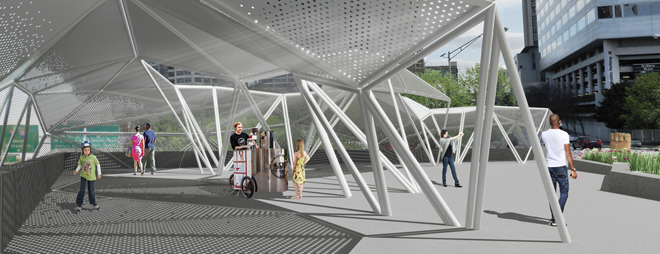
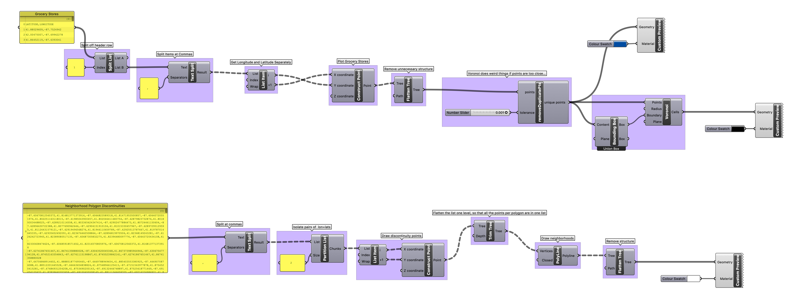
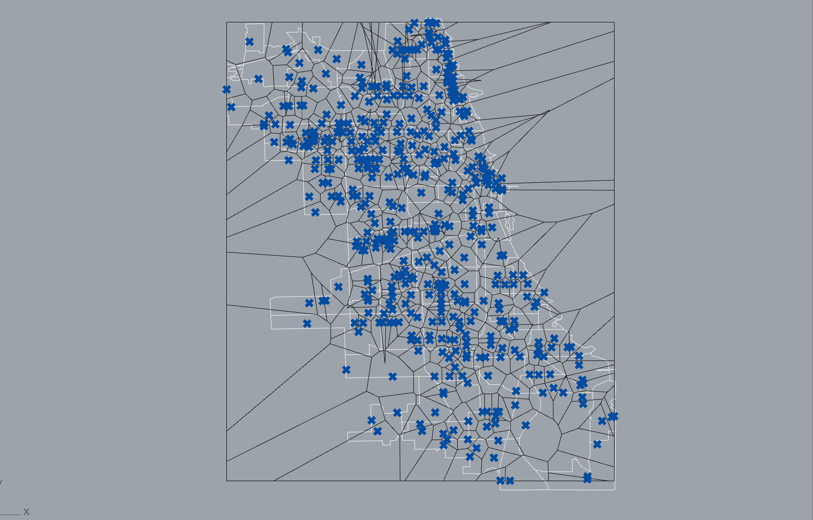
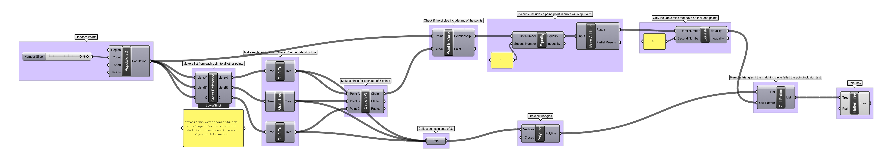
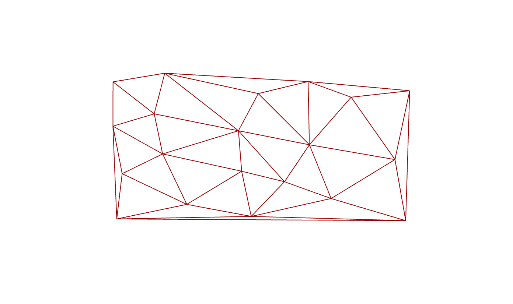

# Week 6 · Algorithmic Processes

We'll examine this week how contemporary designers are implementing iterative algorithmic processes to address complex design problems.

In particular, we'll look at the related [Delaunay Triangulation](https://en.wikipedia.org/wiki/Delaunay_triangulation) and [Voronoi Tesselation](https://en.wikipedia.org/wiki/Voronoi_diagram) — simple mathematical models for complex natural phenomena.

-----

### References for the Week

Some examples of pattern algorithm design work.

- [Voronoi at Thingiverse](https://www.thingiverse.com/search?q=voronoi)
- [Jerusalem Table](https://www.core77.com/projects/39363/Jerusalem-Tables)
- [Nervous System](https://n-e-r-v-o-u-s.com/projects/)
- [Marc Newson Voronoi Shelf](http://marc-newson.com/voronoi-shelf/)
- [Go Wheel Chair](http://layerdesign.com/projects/go/)
- [Bespoke 3D Orthopedics Brace](https://www.youtube.com/watch?v=OGRkNexY3N8)
- [Interactive Subdivision](https://www.khanacademy.org/partner-content/pixar/modeling-character/modeling-subdivision/p/interactive-subdivision-in-3d)
- [Unyq](http://unyq.com/en-us/us/)
- [Osteoid Ultrasonic Cast](https://competition.adesignaward.com/design.php?ID=34151)
- [Cortex Cast](http://www.evilldesign.com/cortex)
- [Thermal Comfort Casts](https://3dprint.com/192877/3d-printed-cast-thermal-comfort/)
- [XKELET Hand and Wrist Fracture Cast](https://www.xkelet.com/en/)
- [How to Hand Draw Delaunay and Voronoi](http://765.blogspot.com/2009/09/how-to-draw-voronoi-diagram.html)
- [Simple Interactive Voronoi Editor](http://www.sygreer.com/projects/voronoi/)
- [Interactive Javascript Translation](http://paperjs.org/examples/voronoi/)
- [World Capitals Voronoi](https://www.jasondavies.com/maps/voronoi/capitals/)
- [In D3 Data Viz Library](https://github.com/d3/d3-delaunay)
- [Anna Nowak on Application of Voronoi diagrams in contemporary architecture and town planning](https://yadda.icm.edu.pl/baztech/element/bwmeta1.element.baztech-5259df1a-e1f7-442f-a68c-10c0c2b35c96/c/chmot62_06.pdf)
- [All the Maths](http://cgl.uni-jena.de/pub/Workshops/WebHome/cgl12new.pdf)
- [Easier to Understand All the Maths](https://meemoo.org/blog/2014-07-14-noflo-geometry)

-----

### Triangulation, Tesselation, Subdivision

#### Delaunay Triangulation

Developed in the 1930s by Russian geometer [Boris Delaunay](https://en.wikipedia.org/wiki/Boris_Delaunay), the [Delaunay triangulation](https://en.wikipedia.org/wiki/Delaunay_triangulation) is essential to nearly all computer graphics. Whenever you hear or talk about a 'mesh', that's likely based on a Delaunay Triangulation! Videogames, visual effects for cinema, medical scanning, arcGIS geographic data — everything! It is also in heavy use by structural engineers, and unintentionally undergirds nearly all of the truss geometries that define bridges, attics, and other triangular structures as well as communication network routing. More recently, as autonomous vehicles begin to explore unmapped areas where sensors may fail, Delaunay Triangulation logic is used to [allow intelligent agents to navigate dangerous boundaries](https://en.wikipedia.org/wiki/Constrained_Delaunay_triangulation). 

In 3D space, the triangulation creates a *network topography* of triangular cells, based on known points to support, which would use the minimal amount of connective material to maintain, in opposition to a *singular force vector*. Imagine the Delaunay set as the circus net for trapeze artists, which would stretch and deform as the gymnasts fall into it and bounce around in it. That same net would not work very well to catch someone launched into it from the side...

To produce a Delaunay Mesh...

- Sprinkle random points on a 2D plane
- Draw all possible circles defined by any of the 3 points
- If those circles contain *any* of the sprinkled points, that circle should be discarded
- If a circle passes the test, then draw the [circumscribed triangle](https://en.wikipedia.org/wiki/Circumscribed_circle) as an edge

-----

#### Voronoi Tesselation

The geometric [*dual*](https://en.wikipedia.org/wiki/Dual_polyhedron) of the Delaunay Triangulation, [Voronoi Tesselation](https://en.wikipedia.org/wiki/Voronoi_diagram) invented by another amazing Russian mathematician — [Georgy Voronoi](https://en.wikipedia.org/wiki/Georgy_Voronoy) — similarly tiles a plane with shapes — though not not usually triangles. The unusual cells that come out of the Voronoi Tesselation model fairly accurately a multitude of natural formal phenomena as well as behaviors. Bone microstructure, sponge anatomy, soil clumping, termite and bee architecture, neuron network arrangement.... the list is almost endless. This is because the Voronoi Tesselation models an *efficient* set of cells. All of the space within a single Voronoi cell is *closer* to the centroid of a Delaunay triangle, and as a result, Voronoi logic approximates how any agent might make a decision about which of a set of possible choices should be chosen based purely on efficiently traversing or covering a plane or volume. It is increasingly being used by public policymakers to [place train stops, design road networks](http://datagenetics.com/blog/may12017/index.html), and [predict crime](https://www.tandfonline.com/doi/abs/10.1080/00330124.2017.1288578?scroll=top&needAccess=true&journalCode=rtpg20).

- Generate a Delaunay Triangulation
- Find the midpoint of each edge, and draw a line perpendicular to the edge
- Intersect all these lines, and clip adjacent lines with one another
- Draw the remnant, irregular polygons

-----

### Grasshopper Algorithmic Forms

#### Voronoi Food Regions in Chicago

Based on [these neighborhood bounds](https://data.cityofchicago.org/Facilities-Geographic-Boundaries/Boundaries-Neighborhoods/bbvz-uum9) and these [grocery store locations](https://data.cityofchicago.org/Community-Economic-Development/Grocery-Stores-2013/53t8-wyrc), let's use the Voronoi algorithm to try to predict which grocery store any given resident might visit.

Download the pre-processed [neighborhood boundaries](neighborhoodDiscontinuities.txt) and [grocery store](groceryStores.csv) coordinates.

[Download](grocery-definition.gh)

-----

#### 'Simple' Delaunay Triangulation

From a field of random points, create a Delaunay triangulation.

[Download](delaunay-definition.gh)

-----

#### Data-Driven Voronoi Cast

Create a voronoi tesselation in 3D space around a data-driven, anatomical form like the [Cortex Cast](https://www.evilldesign.com/cortex). Allow for variable cell openness, based on attractor curve, to create additional rigidity around the break.

[Download](voronoi-cast-definition-updated.gh)

-----

### Homework

##### Grasshopper I (1 hour)

Finish the *Voronoi Food Regions in Chicago* example we started, and complete the *Data-Driven Voronoi Cast* example above. The latter uses new nodes in new ways -- so we'll discuss it first thing next week. Please have questions prepared.

##### Grasshopper II (1 hour)

Given [this slightly cleaned-up dataset](corona.csv) on Coronavirus spread (original dataset on [Kaggle](https://www.kaggle.com/sudalairajkumar/novel-corona-virus-2019-dataset)), could you make a map of the Coronoavirus' geographic penetration similar to this one?

Note that this is a [terrible map](https://www.esri.com/arcgis-blog/products/product/mapping/mapping-coronavirus-responsibly/), but perhaps there is more to be gained from exaggerating expression than by maximizing legibility?

##### Listening and Watching I (1 hour)

Continuing our exploration into other algorithmic spaces, read through a few articles on *algorithmic fashion* and the coming nightmare dystopia of... Everyone wearing the same thing? Everyone wearing different things? It's hard to know, so let's read a few short articles and poke through some resources and inspiration. 

Please read through some short articles...

- Richard Yao on the [Inherent Tension Driving the Future of Fashion](https://medium.com/ipg-media-lab/the-inherent-tension-driving-the-future-of-fashion-b9481d8daee3)

- Tony Peng from [Synced](https://syncedreview.com) on [AI Fashion Design](https://syncedreview.com/2019/04/04/is-the-fashion-world-ready-for-ai-designed-dresses/)

- Kyle Chayka from [Racked](https://www.vox.com/racked-on-vox) wrote a piece on [Algorithmic Style](https://www.vox.com/2018/4/17/17219166/fashion-style-algorithm-amazon-echo-look) and expanded it into a larger (optional to read) discussion on [monoculture](https://www.vox.com/the-goods/2019/12/17/21024439/monoculture-algorithm-netflix-spotify). 

Scroll through...

- Stichfix's ["Algorithm Tour"](https://algorithms-tour.stitchfix.com) and the rest of their technology blog [Multithreaded](https://multithreaded.stitchfix.com).

Listen...

- The *AI Podcast* [interview with Stitch Fix's Chief Algorithms Officer Brad Klingenberg](https://www.stitcher.com/podcast/ai-podcast/the-ai-podcast/e/62476881)

Some more optional stuff -- if you would like to read a slightly more extractive take on some of these topics, check out...

- McKinsey's report on [How technology can drive the next wave of mass customization](https://www.mckinsey.com/~/media/mckinsey/dotcom/client_service/bto/pdf/mobt32_02-09_masscustom_r4.ashx).

To recover from the McKinsey, if you want more of a social lens...

- Ahmet Öğüt on [From Self-Design to Algorithmic-Design](https://www.e-flux.com/journal/98/256669/from-self-design-to-algorithmic-design/)

#### Listening and Watching II (10 minutes)

Remember our discussion about all music having already been composed? Some [recent, controversial, satirical generative music efforts](https://www.musictech.net/news/programmers-generate-every-possible-melody-in-midi-to-prevent-lawsuits/) attempt to supercede some of the mismatches between existing international copyright laws and algorithmic creativity. Any thoughts on this? Could we be aiming for the design equivalent?

##### Visualization Practice (1 hour, spread out over week)

Take a look at the Dear Data week sixteen on *Closets* in preparation for next week. Through the week, construct a dataset for your own visualization purposes on what is in your closet or dresser/wardrobe in your apartment or home, and produce 3 visualizations on 5"x7" cards. Explore both 2D and 3D visualization opportunities, and prepare to share these with your peers. Crayons, color pencils, and play-doh are available in the faculty corridor on Zach's desk. Add a legibility key to the backs of all visualizations, and document them in the Google Drive.

##### Submit Work

Please submit homework into the appropriate folders in the class Google Drive.
