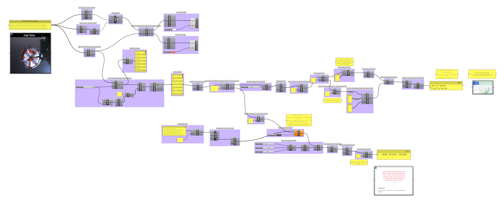

# Week 6 · Branching

A break for review, with continuing focus on the creation and manipulation of branching data structures.

-----

### Grasshopper Review Files

#### Build a Dataset, Destroy a Dataset, Rebuild a Dataset

Take some polygons, turn them into points, extract coordinates, and rebuild polygons. Sustainable! 

[Download](trees-definition.gh)

-----

#### Twisting Things!

Weird, controllable, helical structures — designed to reinforce and expand upon the explanations in the file above.

[Download](twists-definition.gh)

-----

#### NASA's Perseverance Secret Parachute Message

For fun - NASA's Perseverance Mars Lander had a [secret message encoded in its parachute](https://www.cbsnews.com/news/nasa-mars-perseverance-rover-parachute-hidden-message-binary-code/). This file recreates the pattern on the parachute, and translates the encoded statement, which requires a few back-and-forths between [decimal, binary, and ASCII](https://www.ascii-code.com). It's great tree management practice!

[Download](parachute-definition.gh)

-----

### Homework

Consult the Miro board for homework outline.