# Week 8 · Evolutionary Modeling

Ever wanted to let your design projects design themselves? This is the week for you! 

Let'e examine how an [iterative 'AI' modeled on evolutionary genetic descent](https://en.wikipedia.org/wiki/Evolutionary_algorithm) can be integrated into the design process. Evolutionary modeling allows us to [biomimetically](https://en.wikipedia.org/wiki/Biomimetics) integrate the methods that life itself has used over millenia to optimize itself to a tremendous diversity of environmental contexts. Just like real world natural environments, generative designers can model a complex system as a set of rewards and punishments, and push various effectively random lifeforms (our designs!) through the system to see how each fares. Successful lifeforms pass their genes on, and struggling organisms and their genetics go extinct over time. [Mutation](https://en.wikipedia.org/wiki/Cancer) keeps things interesting and ensures lifeforms do not [*over-specify*](https://en.wikipedia.org/wiki/Adaptation) and become so *specific* that any environmental change would [lead to their demise without intervention](https://qz.com/1308730/modern-pandas-should-have-died-out-years-ago/), and the process repeats until a [*local optimum*](https://en.wikipedia.org/wiki/Local_optimum) is discovered. 

##### [Darwin's finches](https://en.wikipedia.org/wiki/Darwin%27s_finches)

These sorts of tools have recently been adopted, and increasingly are being accepted, in [public policy development](https://medium.com/@numanovicamar/https-medium-com-numanovicamar-data-science-the-next-frontier-for-data-driven-policy-making-8abe98159748) and [problem solving](https://ideas.repec.org/a/ssi/jouesi/v4y2017i3p364-379.html) as well as [urban planning discourse](https://www.researchgate.net/publication/32884865_Integrated_Urban_Evolutionary_Modeling) — opening up these disciplines to design methodology and systems thinking. Perhaps, evolutionary modeling might be explained as the computational version of system modeling?

This approach is where *Generative Design* itself found its name. The relevant algorithms are fairly straightforward compared to others we have discussed, but due to their use in many different domains, they go by many different names: evolutionary modeling, genetic algorithms, life simulation, etc... 

Very importantly, play with [genetic cars](http://rednuht.org/genetic_cars_2/).

-----

### References for the Week

Some examples of evolutionarily modeled forms and solutions.

- [Evolving Floorplans](http://www.joelsimon.net/evo_floorplans.html)
- [Evolving Design by Danil Nagy](https://medium.com/generative-design/evolving-design-b0941a17b759)
- [Engine Block, Chair, Medical Implants](https://www.wired.com/2015/09/bizarre-bony-looking-future-algorithmic-design/)
- [Aesthetics of Simple 3D Form](https://agatakycia.com/2011/12/28/aesthetics-and-creativity-in-evolutionary-design/)
- [Yacht Geometry for Ideal Hydrodynamics and Displacement](http://www.cupinfo.com/en/americas-cup-automated-yacht-design-optimization.php)
- [Antennas for Unusual Environments](https://en.wikipedia.org/wiki/Evolved_antenna)
- [Beach Walking Animals](http://www.strandbeest.com)
- [Stadium Roof Design](https://www.youtube.com/watch?v=RQIXJMmm-0A)
- [Complex Joint Design](https://www.youtube.com/watch?v=wB-Q4erLMYE)
- [Shoes](https://vimeo.com/user2852610)
- [Solar Carve Tower](http://www.archdaily.com/806233/new-images-of-studio-gangs-solar-carve-tower-revealed-as-project-gets-underway)
- [Minimum Solar Exposure to Save Cooling Expense](https://yazdanistudioresearch.wordpress.com/2015/02/09/building-optimization-tools-the-grasshopper-definition-and-breakdown/)
- [Max Solar Exposure](https://gonzalesarch.wordpress.com/tag/grasshopper/)
- [Best Airflow and Heating for Poulty Facility](https://bioarchitecturestudio.com/2011/07/21/organic-farm-yard-pedregal-del-fresno-grasshopper-galapagos/)
- [College Quad Layout based on Desire Lines](http://isia.ir/semiology/)
- [Room Arrangement](http://omarohelmy.blogspot.com/2013/01/experiments-in-space-planning-using.html)
- [Room Arrangment 2](https://www.youtube.com/watch?v=SWyE3V6LKCc)
- [Awning Design](http://archi-lab.net/form-finding-with-grasshoppergalapagos/)
- [Building Layout and Window View Optimization](http://designplaygrounds.com/blog/view-optimization-using-galapagos-for-grasshopper/)
- [Trusses](http://golancourses.net/2013/projects/genetic-algorithm-optimal-trusses/)
- [Wind Turbine Blade](https://www.youtube.com/watch?v=YZUNRmwoijw)
- [Learning to Stand](https://www.youtube.com/watch?v=lPQnVEnFTgY)
- [Learning to Walk](https://vimeo.com/85053197)
- [Learning to Walk and Survive Impact!](https://www.youtube.com/watch?v=pgaEE27nsQw)
- [Max Volume : Minimum Area](http://gracefulspoon.com/blog/2011/06/05/bucky-was-right)
- [Breeding Tables](http://www.kramweisshaar.com/projects/breeding-tables)
- [Assorted Examples](http://legacy.iaacblog.com/maa2013-2014-designing-associativity/)
- [Complete Architectural Design from Lot Orientation to Room Details](https://www.youtube.com/watch?v=3sM6qUUJxus)
- [Better Box Car 2D that Doesn't Require Flash](http://rednuht.org/genetic_cars_2/)
- [Motor Train](https://bib.irb.hr/datoteka/255484.383.pdf)
- [Locomotion System](http://www.demo.cs.brandeis.edu/golem/design.html)

-----

### Evolutionary Algorithms

Any design challenge, once a certain level of precision is achieved, could be tackled through an evolutionary solver. All that is required is that the design challenge have a clear goal to minimize or maximize (the **fitness**), which is in some way dependent by the interplay between a set of variables (the **genome**). After both are isolated, we let a comparison process (**breeding** and **inheritance**) identify performative combinations of genes. We consider our designs as living species, and let them computationally evolve over and over again, until we are satisfied with their performance.

### Genomes

The *genome* is a set of parameters that define how a species, or design, succeeds or fails in its environment. Genomes are often highly multidimensional — often creating a [combinatorial explosion](https://en.wikipedia.org/wiki/Combinatorial_explosion) that would make it difficult for a designer to optimize, or even fully comprehend, how all the parameters interrelate (Sound familiar? Isn't this the fundamental designer experience?). To over-simplify, though, we can think of the genome as a set of Grasshopper sliders and other inputs that describe a family of related design outcomes. 

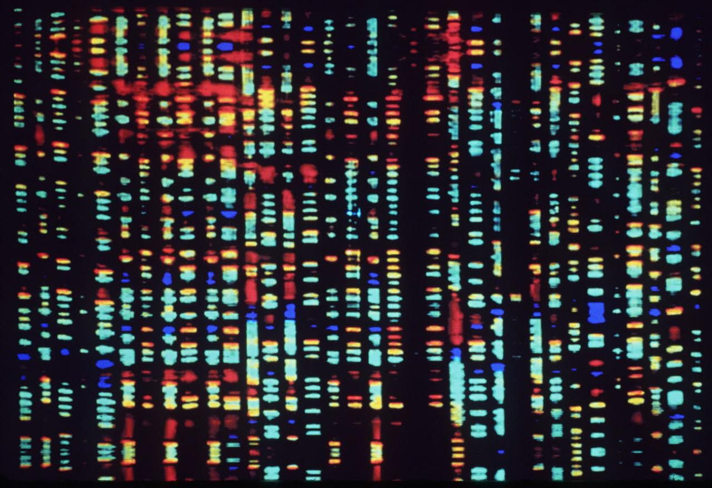
##### [Human Genome](https://en.wikipedia.org/wiki/Human_genome)

The human genome, our sliders, are the ~20,000 genes, each containing a sequence of 3 of the 4 available [A,C,T,G nucleotides](https://en.wikipedia.org/wiki/Nucleic_acid_sequence), that encode everything from our height to our eye color to our toenail thickness to our lung volume to our cognitive reactions to anxiety. If we as a species were able to understand and control all of the combinatorial permutations of those genes, we would be able to cure cancer, prevent congenital disease, and ensure we only grew *exactly the right amount* of eyebrow hair to prevent sweat from getting in our eyes, shield our sensitive retinas from the sun when we squint, and maximize  cultural and aethetic value. But how much is the *right* amount of eyebrow hair? Doesn't it depend on a million other factors? What the heck does all this even mean? The language in this space often feels dangerously close to [eugenics](https://en.wikipedia.org/wiki/Eugenics) — and its important to recognize that anything we optimize through an evolutionary model is effectively freezing and simplifying an uncountably large number of dynamic factors in service of identifying a one-of-many, temporary, and (most importantly) *local* optimum. We rarely identify the absolute best choice, but rather discover *local optima*.

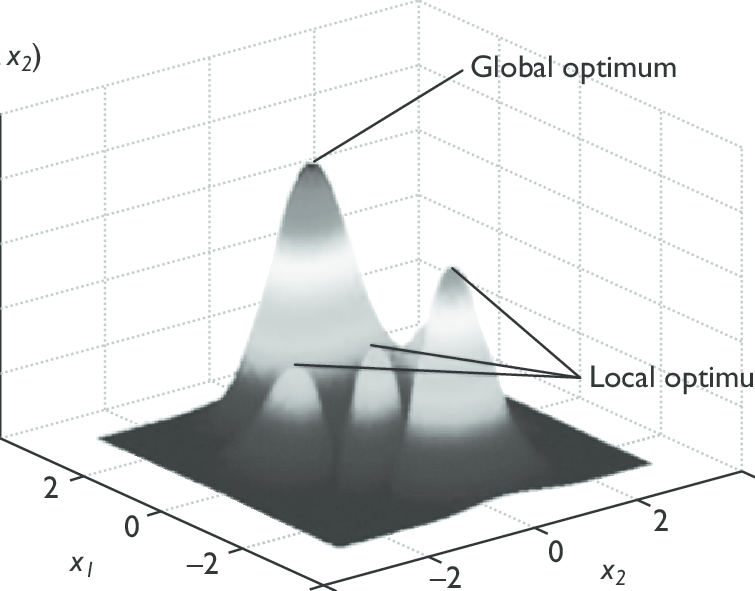
##### [Local vs. Global Optima](https://en.wikipedia.org/wiki/Local_optimum)

Evolutionary modeling also assumes *efficiency and survival* are the ultimate goals, which might not be the case in a design project that focuses on regulation rather that perpetuation.

### Genetic Fitness

Genomes are great — they describe all the possible species we seek to compare — but we need to be able to identify which combinations of genes in the genome perform *contextually better* than others. We term the outcome of this performance evaluation the *fitness* of the species. In Grasshopper terms, this is often a set of mathematical analyses and tests we perform on a design species to identify how well it fulfills our design goals.

*Fitness* can be complex and synthesized from several factors, and the most productive fitnesses for evolutionary algorithms to address are those that implement oppositional forces on the genome (3D volume and material use in a building are naturally opposed. So too is height and structural rigidity in a wind turbine, aerodynamics and fuel load in a rocket, product lifespan and climate impact of consumer goods, staffing costs and number of physical locations for a startup retail venue...). By including this tension in the fitness equation, we allow our algorithm to find emergent opportunities, unconsidered routes to success, and least-damaging compromises. 

In lifeforms the interplay is similar — bigness is great for overpowering and eating other animals, but if you're bigger, you need more calories to move around and maintain your body heat. Those competing factors introduce highly differentiated opportunities — life is a game that can be won with many different strategies — which helps to explain why our planet bristles with such divergent lifeforms across similar environments. Just as a large, calorie-needy, slow-to-grow carnivore can survive as a species producing a single offspring with a long carrying term per year; so too can small social herbivores with short lifespans, low energy needs, and prodigious and early reproduction. But, if the weather or environment were to slightly change (therefore altering the fitness equation), these highly targeted strategies can become quickly destabilized. The very small but very quick, in absolute terms, climate change we are now experiencing is more than enough to fundamentally undo millenia of careful genetic honing and refinement and lead to a [dramatic collapse in biodiverity](https://theconversation.com/climate-change-could-cause-abrupt-biodiversity-losses-this-century-135968). *Less specific* lifeforms do better in times of change, as their more average fitness across a variety of different contexts leads to their survival while *more specific* species are crippled by subtly-changing contexts. Raccoons will do fine in a destabilized climate. Pandas, however, will likely not.

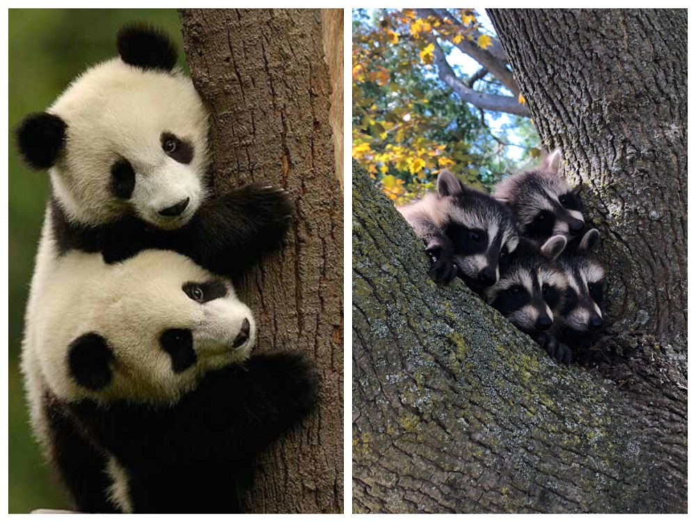

Unfortunately, when implementing modeling evolutionary pressures as a design process, we often need to significantly simplify and analogize the fitness and genome. The more parameters that define the genome, the more varied and successful the outcomes can be, at the expense of computing time. Just like in living organisms, a healthy genome is defined by variability, specificity, and a lack of redundency. But, with too large a genome, we allow far too many routes to survival and success, too much room for random mutations to mislead our evolutionary trends, and our design will likely never converge on our goals. Conversely, with too narrow a fitness aperture, our algorithms might need an infinite amount of time to identify a viable species. How many genes is too many? How wide a fitness definition is appropriate? 

Sigh, it will always be situationally dependent, and require experimentation. 

### Breeding and Inheritance

Once we have defined a genome and fitness, we let evolutionary modeling emulate the passage of time and [*amorous congress*](https://www.theatlantic.com/health/archive/2012/09/amorous-congress-lurid-nineteenth-century-sex-terminology/261988/).

A random sampling of genome combinations are generated, in what is termed a *generation* of individual species. These genomes have their fitness tested, and the species that have high fitness values are *more likely* to become parents of the next generation, and to pass their genes on — in combination — to the next generation.

A certain amount of randomness is introduced into the gene pool each generation, modeling both [genetic drift](https://en.wikipedia.org/wiki/Genetic_drift) and [mutation](https://en.wikipedia.org/wiki/Mutation). But, the high-fitness parents of the previous generations have an outsized role in shaping the genes of their descendents. This process is called genome *inheritance*, and most generative design tools give fine-grained control over how many genes are allowed to pass-on, how much mutation is introduced each generation, and how many *parents* are elected to pass-on their genes to the next generation.

The process is repeated for however many generations are sought. In the beginning, randomness dominates and outcomes are often awful at fulfilling the fitness objectives. Over time, success strategies emerge, and fitness dramatically improves. 

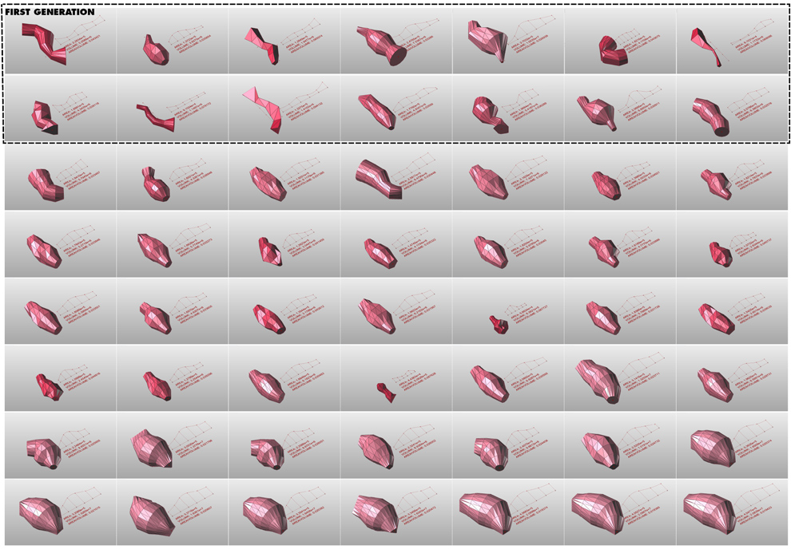
##### [Algorihtmic Architect John Locke](http://gracefulspoon.com/blog/tag/grasshopper/)

Eventually, though, the gene pool narrows to the point that variations between species become very, very small and further improvement demonstrates diminishing returns. Often, generative modeling tools allow the designer to "shake-up" these honed genomes at this point by introducting more randomness, *mutation*, to ensure that species do not pursue strategies over generations, when a nearby local optimum might perform better. 

There is one critical rule. We need to ensure our genomes and fitnesses **never** include randomness. The randomness comes from the genetic algorithm itself — and if we include random numbers in our genome or fitnes definition — our evolutionary breeding process will never stabilize. The algorithm needs to be able to have deterministic control over all aspects of the genome and fitness equation.

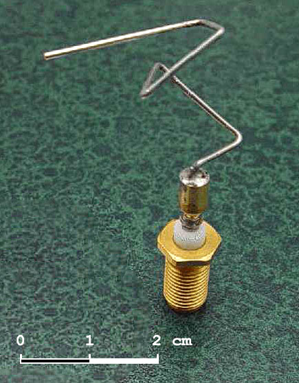
[This is not random!](https://en.wikipedia.org/wiki/Evolved_antenna)

And, that's it. We wait, and let generations pass, with the evolutionary algorithm improving our designs as we allow the computer to calculate new generations.

In grasshopper, the management of time and breeding is handled in the *Galapagos* node, named for the Pacific island archipelago where Charles Darwin conceptualized his theory of evolution.

### Evolutionary Tools in the Design Process

Life has needed to adapt to both a changing [*fitness landscape*](https://en.wikipedia.org/wiki/Fitness_landscape) (climate change, weather patterns, competitive lifeforms over time) as well as remarkably diverse *fitness conditions* ([the open sea, the air, reefs, rainforest canopy, deserts](https://en.wikipedia.org/wiki/Biome)...) and as a result our planet offers remarkably diverse outcomes of specific local maxima solutions — which we call *species*. Note the [language overlap](https://www.etymonline.com/search?q=specific), and also how (big assumption!) engaging and accessible the content is this week, compared to previous discussions of algorithms. Sex! Animals! Inheritance! Mutation! 

This is worth noting - genetic algorithms are a powerful *metaphor* for the design process. It is both whimsical yet expressive, procedural yet creative, quasi-spiritual and scientific at the same time. In Zach's personal design experience, it is by far the most engaging generative design approach for clients, who nearly always smile when they think about a design solution *evolving* in front of their eyes. We might ask ourselves - what other concepts in evolutionary biology might be worthy models for future generative design tools? For example, might the phenomenon of [convergent evolution](https://en.wikipedia.org/wiki/Convergent_evolution) help us better articulate and model services and systems? Could [mutualistic relationships](https://en.wikipedia.org/wiki/Mutualism_(biology)) serve as a powerful exemplars of [iterative co-design](https://medium.com/@thestratosgroup/co-design-a-powerful-force-for-creativity-and-collaboration-bed1e0f13d46)?

-----

### Grasshopper Algorithmic Forms

#### Simple Example

Let's teach a computer to evolve polygons.

[Download](polygon-definition.gh)

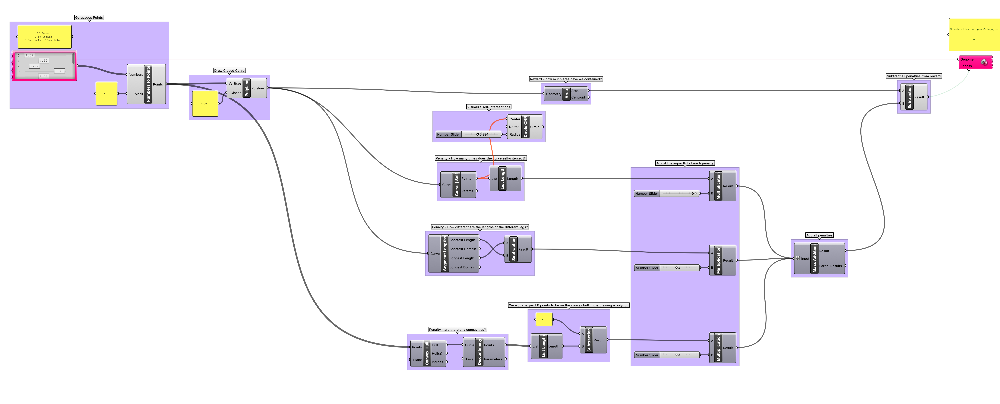

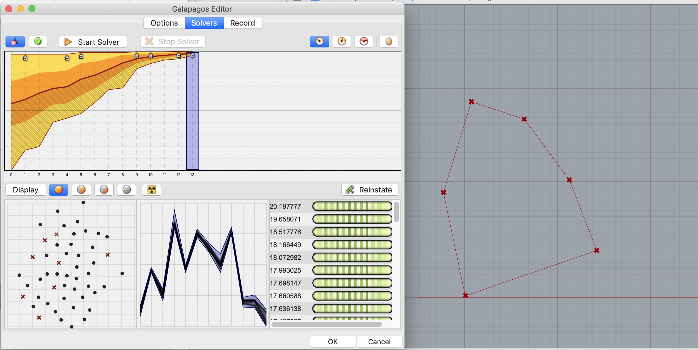

-----

#### Nesting Shapes

Rotate and place weirdly shaped pieces into a boundary without overlapping and with minimal wasted margins. This logic is useful for [nesting forms for laser cutting](https://www.tdmsolutions.com/rhinonest/), building AIs for [tangrams](https://en.wikipedia.org/wiki/Tangram), or [pepakura](https://tamasoft.co.jp/pepakura-en/) crafting! 

[Download](tangram-definition.gh)

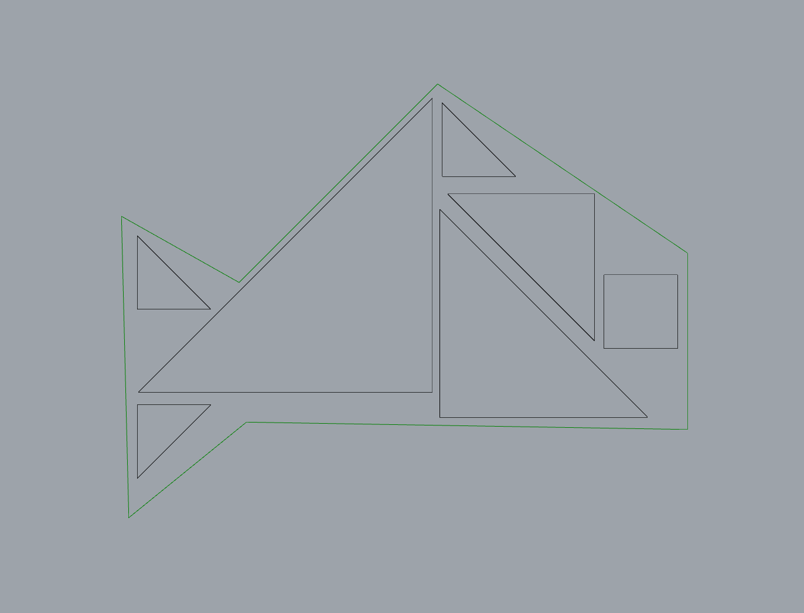

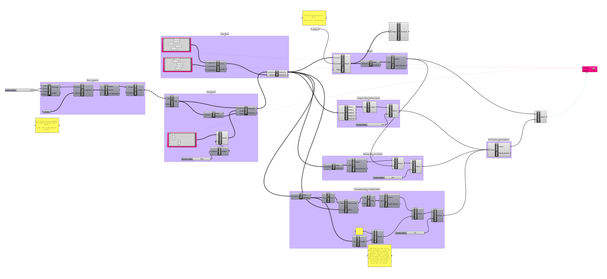

-----

#### Solar Carve

Minimize cast shadow but maximize volume. Take a look at Studio Gang's [Solar Carve Tower](http://www.archdaily.com/806233/new-images-of-studio-gangs-solar-carve-tower-revealed-as-project-gets-underway) to see these techniques applied.

[Download](solar-carve-definition.gh)

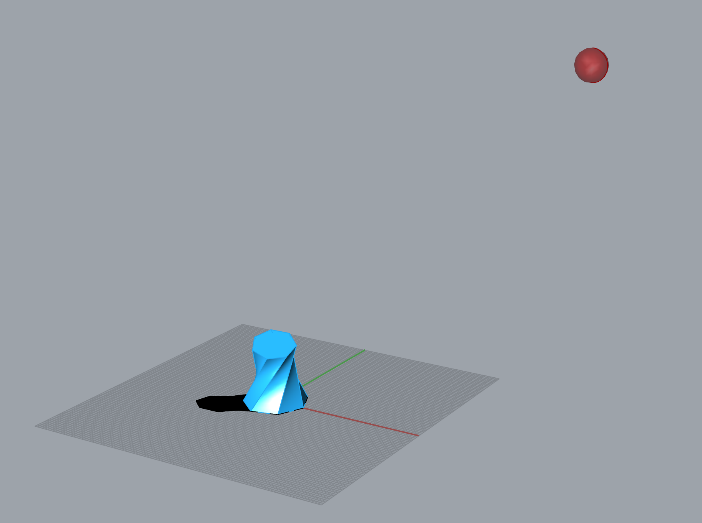

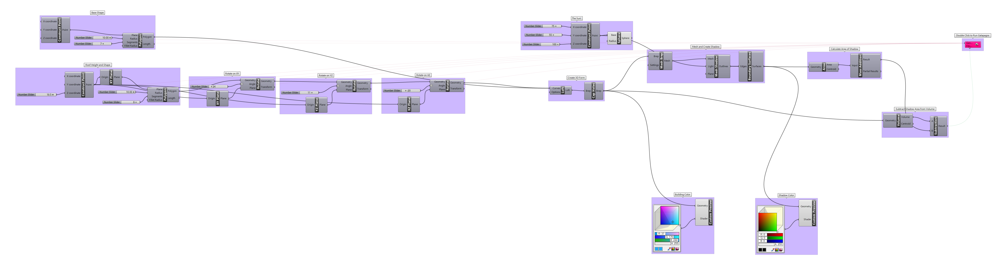

----

#### Railway Routing

Route a train line through a city to adequately serve population centers. This is a variation of a common mathematical puzzle, the [traveling salesman problem](https://en.wikipedia.org/wiki/Travelling_salesman_problem), which is a common mathematical model for many routing and navigation challenges. 

[Download](subway-definition.gh)

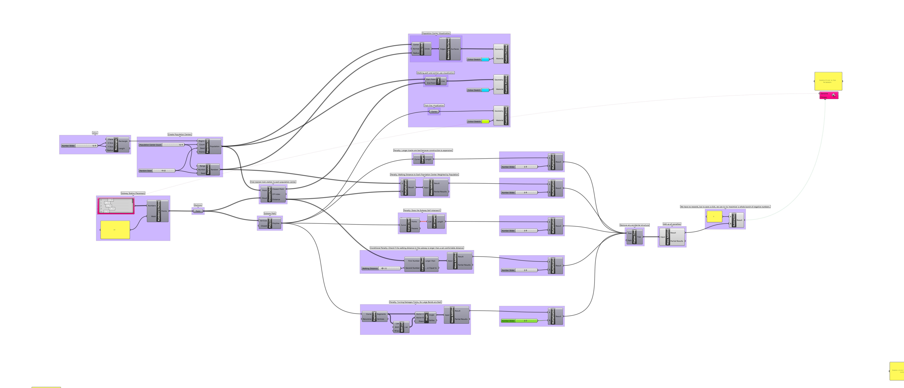

-----

### Homework

To come after class.